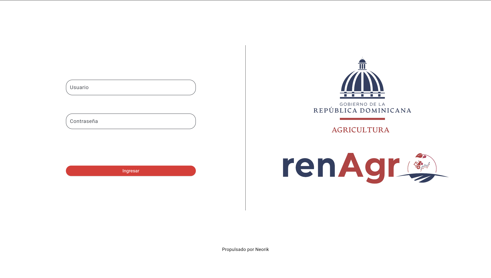
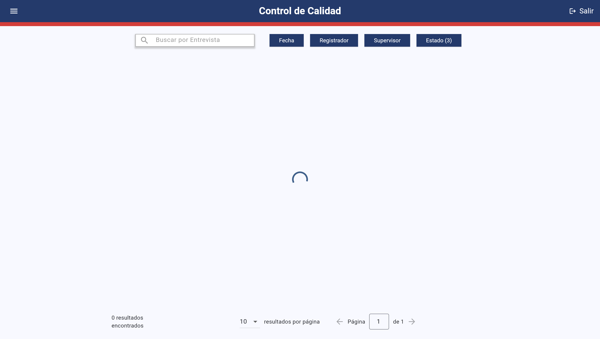
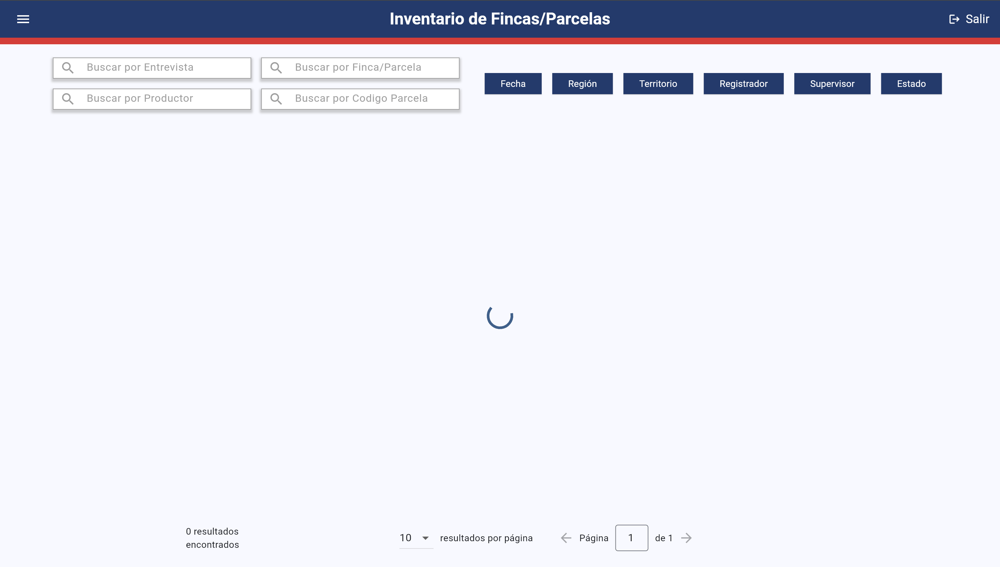

# RENAGRO - Quality Control & Farm Inventory System

## Overview
RENAGRO is a Flutter-based application designed for **quality control and data management** in agricultural surveys. It integrates with a **FastAPI backend** and provides tools for monitoring activities, managing interviews, and maintaining farm inventories.

## Features
- **User Authentication** (Login system with roles: Interviewer, Supervisor, Admin).
- **Data Filtering & Sorting** (Dropdown menus, checkboxes, and search functionality).
- **Backend Pagination** (Optimized performance for large datasets).
- **Interactive Tables** (Interview records, farm data, and activity logs).
- **Google Maps Integration** (View farm locations on an interactive map).
- **Data Exporting** (Generate PDF and CSV reports).
- **Interview Approval System** (Supervisors can approve or reject interviews).

## Installation
To run this project locally, follow these steps:

## Tech Stack
### **Frontend (Flutter)**
- **Framework**: Flutter (Dart)
- **State Management**: Riverpod
- **UI Components**: Material Design
- **Google Maps API**: Used for interactive farm locations

### **Backend (FastAPI)**
- **Framework**: FastAPI (Python)
- **Database**: Redis (for caching survey data)
- **External API Integration**: Survey Solutions
- **Containerization**: Docker

## Folder Structure
```
/api                      # Backend (FastAPI)
  ├── apiRenagro.py       # Defines API endpoints
  ├── apiFunciones.py     # Utility functions for database interaction
  ├── requirements.txt    # Python dependencies
  ├── Dockerfile          # API containerization

/lib                      # Flutter frontend
  ├── main.dart           # Application entry point
  ├── globals.dart        # Global configurations
  ├── /screens            # UI screens (Login, Interviews, Farms, etc.)
  ├── /services           # API service handlers
  ├── /utils              # Report generators (PDF, CSV)
  ├── /widgets            # Reusable UI components (Tables, Filters, Map, etc.)
```

## Screenshots



